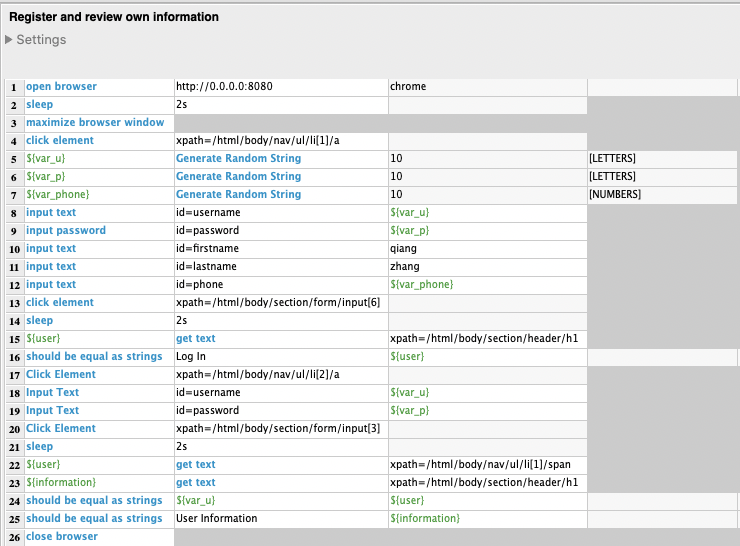

#  Flask_APP TEST

## API automation-requests with Python

### Environment
Python 3.7.11
Required Python packages : `requests`, `string`, random, unittest, os, HTMLTestruner

### Files
`Flasky_API_test.py`: can run directly,  test results are as follows:
1. Randomly generate user information and register.
```python
----random_user_generator----
Username:	 nh 
Password:	 T8TNf0z2 
First name:	 jH 
Last name:	 cFZ 
Phone num:	 736786563

----------register-------------
Status:	 SUCCESS
Register message:	 Created
```

2. Review all registered users.
```python
--------review registered users---------
Status: 	 SUCCESS
```

3. Get personal information after authenticated.
```python
--------get_user_info---------
Status: 	 SUCCESS
User info: 	 {'firstname': 'jH', 'lastname': 'cFZ', 'phone': '736786563'}
```

4. Update personal information after authenticated.
```python
Update Status:	 SUCCESS

--------get_user_info---------
Status: 	 SUCCESS
User info: 	 {'firstname': 'mSxp', 'lastname': 'hlfT', 'phone': '584234'}
```

`unittest.py`: If want this file run, should put this file and Flasky_API_test.py in same path. After run this file, can get  a .html file(test report) at a specific path written in the unittest.py (path can be changed), test report is as follow:

##  UI automation with Robot Framework

### Environment
Python 3.7.11
Required Python packages: robotframework 3.1.2, robotframework-ride 2.0b2.dev4,
robotframework-seleniumlibrary 3.2.0

### Test cases and test results

Register user and review user information.



